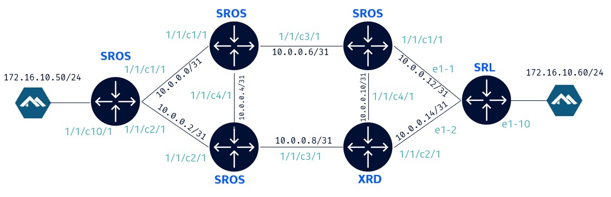
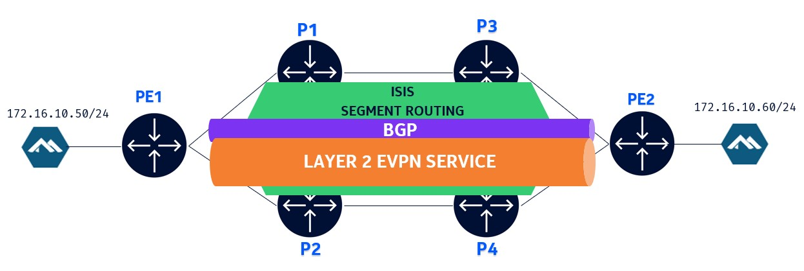

# VM-based nodes in containerlab

VM nodes integration in containerlab is based on the [hellt/vrnetlab](https://github.com/hellt/vrnetlab) project which is a fork of `vrnetlab/vrnetlab` where things were added to make it work with the container networking.

Start with cloning the project:

```bash
cd ~ && git clone https://github.com/hellt/vrnetlab.git && \
cd ~/vrnetlab
```

## Building SR OS container image

SR OS VM image is located at `~/images/sros-vm-24.7.R1.qcow2` on your VM and should be copied to the `~/vrnetlab/sros/` directory before building the container image.

```bash
cp ~/images/sros-vm-24.7.R1.qcow2 ~/vrnetlab/sros/
```

Once copied, we can enter in the `~/vrnetlab/sros` image and build the container image:

```bash
cd ~/vrnetlab/sros && make
```

The resulting image will be tagged as `vrnetlab/nokia_sros:24.7.R1`. This can be verified using `docker images` command.

```bash
REPOSITORY                    TAG       IMAGE ID       CREATED         SIZE
vrnetlab/nokia_sros           24.7.R1   553e94475c12   7 seconds ago   889MB
```

## Deploying the VM-based nodes lab

With the sros image built, we can proceed with the lab deployment. We will deploy a multi-node lab with SR OS, SR Linux and Cisco XRd images. Containerlab makes it possible to have a VM based docker node and a native docker node in the same lab.

This is how the topology looks like:



The end goal of this topology is establish connectivity between the 2 clients.

First, let's switch back to the lab directory:

```bash
cd ~/i2-clab/20-vm
```

Now lets deploy the lab:

```bash
sudo clab dep -c
```

The deployment will wait for the SR OS nodes to boot up.

At the end of the deployment, the following table will be displayed. Wait for the sros boot to be completed (see next section), before trying to login to sros.

```bash
╭─────────┬───────────────────────────────────────────────────────────┬─────────┬───────────────────╮
│   Name  │                         Kind/Image                        │  State  │   IPv4/6 Address  │
├─────────┼───────────────────────────────────────────────────────────┼─────────┼───────────────────┤
│ client1 │ linux                                                     │ running │ 172.20.20.8       │
│         │ ghcr.io/srl-labs/network-multitool                        │         │ 3fff:172:20:20::8 │
├─────────┼───────────────────────────────────────────────────────────┼─────────┼───────────────────┤
│ client2 │ linux                                                     │ running │ 172.20.20.9       │
│         │ ghcr.io/srl-labs/network-multitool                        │         │ 3fff:172:20:20::9 │
├─────────┼───────────────────────────────────────────────────────────┼─────────┼───────────────────┤
│ p1-sr1  │ nokia_sros                                                │ running │ 172.20.20.4       │
│         │ vr-sros:24.7.R1                                           │         │ 3fff:172:20:20::4 │
├─────────┼───────────────────────────────────────────────────────────┼─────────┼───────────────────┤
│ p2-sr1  │ nokia_sros                                                │ running │ 172.20.20.6       │
│         │ vr-sros:24.7.R1                                           │         │ 3fff:172:20:20::6 │
├─────────┼───────────────────────────────────────────────────────────┼─────────┼───────────────────┤
│ p3-sr1  │ nokia_sros                                                │ running │ 172.20.20.5       │
│         │ vr-sros:24.7.R1                                           │         │ 3fff:172:20:20::5 │
├─────────┼───────────────────────────────────────────────────────────┼─────────┼───────────────────┤
│ p4-xrd  │ cisco_xrd                                                 │ running │ 172.20.20.3       │
│         │ registry-i2.srexperts.net/library/xrd-control-plane:7.8.1 │         │ 3fff:172:20:20::3 │
├─────────┼───────────────────────────────────────────────────────────┼─────────┼───────────────────┤
│ pe1-sr1 │ nokia_sros                                                │ running │ 172.20.20.7       │
│         │ vr-sros:24.7.R1                                           │         │ 3fff:172:20:20::7 │
├─────────┼───────────────────────────────────────────────────────────┼─────────┼───────────────────┤
│ pe2-srL │ nokia_srlinux                                             │ running │ 172.20.20.2       │
│         │ ghcr.io/nokia/srlinux:24.10.1                             │         │ 3fff:172:20:20::2 │
╰─────────┴───────────────────────────────────────────────────────────┴─────────┴───────────────────╯
```

### Monitoring the boot process

To monitor the boot process of SR OS nodes or Cisco XRd node, you can open a new terminal and run the following command:

```bash
sudo docker logs -f pe1-sr1
```

## Connecting to the nodes

To connect to SR OS node:

```bash
ssh admin@pe1-sr1
```

To connect to SR Linux node:

```bash
ssh pe2-srL
```

To connect to Cisco XRd node:

```bash
ssh p4-xrd
```

Refer to the passwords in your card.

## Configuring the nodes

In the Containerlab topology file, we also specified a `startup-config` for each node.

You may refer to the startup configs [here](startup/).

Each startup config is deploying the following configs:

- Configuring interfaces (to other routers and to the client)
- Configuring IS-IS
- Configuring Segment Routing over IS-IS (SR-ISIS)
- Configuring BGP between PE1 and PE2 system loopback IPs
- Configuring an EVPN service between PE1 and PE2 with SR-ISIS as the tunnel

The logical topology looks like:



### Verifying interface status

After the lab is deployed, let's start verifying the configuration.

Check the interface status on PE1 (SROS):

```srl
show router interface
```

Expected output:

```srl
===============================================================================
Interface Table (Router: Base)
===============================================================================
Interface-Name                   Adm       Opr(v4/v6)  Mode    Port/SapId
   IP-Address                                                  PfxState
-------------------------------------------------------------------------------
To-P1                            Up        Up/Down     Network 1/1/c1/1
   10.0.0.0/31                                                 n/a
To-P2                            Up        Up/Down     Network 1/1/c2/1
   10.0.0.2/31                                                 n/a
system                           Up        Up/Down     Network system
   1.1.1.1/32                                                  n/a
-------------------------------------------------------------------------------
Interfaces : 3
===============================================================================
```

Check the interface status on PE2 (SRLinux):

```srl
show interface
```

Expected output:

```srl
==================================================================================
ethernet-1/1 is up, speed 100G, type None
  ethernet-1/1.0 is up
    Network-instances:
      * Name: default (default)
    Encapsulation   : null
    Type            : routed
    IPv4 addr    : 10.0.0.12/31 (static, preferred, primary)
----------------------------------------------------------------------------------
ethernet-1/2 is up, speed 100G, type None
  ethernet-1/2.0 is up
    Network-instances:
      * Name: default (default)
    Encapsulation   : null
    Type            : routed
    IPv4 addr    : 10.0.0.14/31 (static, preferred, primary)
----------------------------------------------------------------------------------
ethernet-1/10 is up, speed 100G, type None
  ethernet-1/10.0 is up
    Network-instances:
      * Name: store1 (mac-vrf)
    Encapsulation   : null
    Type            : bridged
----------------------------------------------------------------------------------
mgmt0 is up, speed 1G, type None
  mgmt0.0 is up
    Network-instances:
      * Name: mgmt (ip-vrf)
    Encapsulation   : null
    Type            : None
    IPv4 addr    : 172.20.20.5/24 (dhcp, preferred)
    IPv6 addr    : 3fff:172:20:20::5/64 (dhcp, preferred)
    IPv6 addr    : fe80::42:acff:fe14:1405/64 (link-layer, preferred)
----------------------------------------------------------------------------------
system0 is up, speed None, type None
  system0.0 is up
    Network-instances:
      * Name: default (default)
    Encapsulation   : null
    Type            : None
    IPv4 addr    : 2.2.2.2/32 (static, preferred)
----------------------------------------------------------------------------------
==================================================================================
Summary
  0 loopback interfaces configured
  4 ethernet interfaces are up
  1 management interfaces are up
  5 subinterfaces are up
==================================================================================
```

### Verifying IS-IS

Check IS-IS status on PE1 (SROS):

```srl
show router isis status
```

Expected output:

```srl
===============================================================================
Rtr Base ISIS Instance 0 Status
===============================================================================
ISIS Cfg System Id           : 0000.0000.0000
ISIS Oper System Id          : 0010.0100.1001
ISIS Cfg Router Id           : 0.0.0.0
ISIS Oper Router Id          : 1.1.1.1
ISIS Cfg IPv6 Router Id      : ::
ISIS Oper IPv6 Router Id     : ::
ASN                          : 0
Admin State                  : Up
Oper State                   : Up
Ipv4 Routing                 : Enabled
Ipv6 Routing                 : Disabled
<snip>
===============================================================================
```

Check IS-IS status on PE2 (SRLinux):

```srl
show network-instance default protocols isis summary
```

Expected output:

```srl
----------------------------------------------------------------------------------
Network instance "default", isis instance "1" is enable and up
Instance Id      : 0
Level Capability : L2
Export policy    : None
----------------------------------------------------------------------------------
System-id : 0020.0200.2002
NET       : [ 49.0000.0020.0200.2002.00 ]
Area-id   : [ 49.0000 ]
----------------------------------------------------------------------------------
Ipv4 Router Id : None
Ipv6 Router Id : None
----------------------------------------------------------------------------------
IPv4 routing is enable
IPv6 routing is enable using native topology
<snip>
----------------------------------------------------------------------------------
```

Check IS-IS adjacency on PE1 (SROS)

```srl
show router isis adjacency
```

Expected output:

```srl
===============================================================================
Rtr Base ISIS Instance 0 Adjacency 
===============================================================================
System ID                Usage State Hold Interface                     MT-ID
-------------------------------------------------------------------------------
p1-sr1                   L1L2  Up    24   To-P1                         0
p2-sr1                   L1L2  Up    23   To-P2                         0
-------------------------------------------------------------------------------
Adjacencies : 2
===============================================================================
```

Check IS-IS adjacency on PE2 (SRLinux)

```srl
show network-instance default protocols isis adjacency
```

Expected output:

```srl
---------------------------------------------------------------------------------------------------------------------------
Network Instance: default
Instance        : 1
Instance Id     : 0
+----------------+-----------------+----------------+------------+--------------+-------+----------------+----------------+
| Interface Name | Neighbor System |   Adjacency    | Ip Address | Ipv6 Address | State |      Last      |   Remaining    |
|                |       Id        |     Level      |            |              |       |   transition   |    holdtime    |
+================+=================+================+============+==============+=======+================+================+
| ethernet-1/1.0 | 0330.3303.3033  | L1L2           | 10.0.0.13  | ::           | up    | 2024-12-       | 27             |
|                |                 |                |            |              |       | 05T23:24:38.30 |                |
|                |                 |                |            |              |       | 0Z             |                |
| ethernet-1/2.0 | 0440.4404.4044  | L1L2           | 10.0.0.15  | ::           | up    | 2024-12-       | 30             |
|                |                 |                |            |              |       | 05T23:23:17.20 |                |
|                |                 |                |            |              |       | 0Z             |                |
+----------------+-----------------+----------------+------------+--------------+-------+----------------+----------------+
Adjacency Count: 2
---------------------------------------------------------------------------------------------------------------------------
```

### Verifying Segment Routing

Check tunnel table on PE1 (SROS):

```srl
show router tunnel-table
```

Expected output:

```srl
===============================================================================
IPv4 Tunnel Table (Router: Base)
===============================================================================
Destination           Owner     Encap TunnelId  Pref   Nexthop        Metric
   Color                                                              
-------------------------------------------------------------------------------
2.2.2.2/32            isis (0)  MPLS  524294    11     10.0.0.1       30
10.0.0.1/32           isis (0)  MPLS  524290    11     10.0.0.1       0
10.0.0.3/32           isis (0)  MPLS  524289    11     10.0.0.3       0
11.11.11.11/32        isis (0)  MPLS  524295    11     10.0.0.1       10
22.22.22.22/32        isis (0)  MPLS  524291    11     10.0.0.3       10
33.33.33.33/32        isis (0)  MPLS  524292    11     10.0.0.1       20
44.44.44.44/32        isis (0)  MPLS  524296    11     10.0.0.3       20
-------------------------------------------------------------------------------
Flags: B = BGP or MPLS backup hop available
       L = Loop-Free Alternate (LFA) hop available
       E = Inactive best-external BGP route
       k = RIB-API or Forwarding Policy backup hop
===============================================================================
```

Check tunnel table on PE2 (SRLinux):

```srl
show network-instance default tunnel-table
```

Expected output:

```srl
--------------------------------------------------------------------------------------------------------------------------------------------------
IPv4 tunnel table of network-instance "default"
--------------------------------------------------------------------------------------------------------------------------------------------------
+---------------------+--------+----------------+----------+-----+----------+---------+--------------------------+-------------+-------------+
|     IPv4 Prefix     | Encaps |  Tunnel Type   |  Tunnel  | FIB |  Metric  | Prefere |       Last Update        |  Next-hop   |  Next-hop   |
|                     |  Type  |                |    ID    |     |          |   nce   |                          |   (Type)    |             |
+=====================+========+================+==========+=====+==========+=========+==========================+=============+=============+
| 1.1.1.1/32          | mpls   | sr-isis        | 18001    | Y   | 30       | 11      | 2024-12-05T23:24:48.372Z | 10.0.0.13   | ethernet-   |
|                     |        |                |          |     |          |         |                          | (mpls)      | 1/1.0       |
| 10.0.0.13/32        | mpls   | sr-isis        | 28001    | Y   | 0        | 11      | 2024-12-05T23:24:38.287Z | 10.0.0.13   | ethernet-   |
|                     |        |                |          |     |          |         |                          | (mpls)      | 1/1.0       |
| 10.0.0.15/32        | mpls   | sr-isis        | 28000    | Y   | 0        | 11      | 2024-12-05T23:23:17.205Z | 10.0.0.15   | ethernet-   |
|                     |        |                |          |     |          |         |                          | (mpls)      | 1/2.0       |
| 11.11.11.11/32      | mpls   | sr-isis        | 18201    | Y   | 20       | 11      | 2024-12-05T23:24:42.336Z | 10.0.0.13   | ethernet-   |
|                     |        |                |          |     |          |         |                          | (mpls)      | 1/1.0       |
| 22.22.22.22/32      | mpls   | sr-isis        | 18202    | Y   | 20       | 11      | 2024-12-05T23:24:40.321Z | 10.0.0.15   | ethernet-   |
|                     |        |                |          |     |          |         |                          | (mpls)      | 1/2.0       |
| 33.33.33.33/32      | mpls   | sr-isis        | 18203    | Y   | 10       | 11      | 2024-12-05T23:24:39.299Z | 10.0.0.13   | ethernet-   |
|                     |        |                |          |     |          |         |                          | (mpls)      | 1/1.0       |
| 44.44.44.44/32      | mpls   | sr-isis        | 18004    | Y   | 10       | 11      | 2024-12-05T23:23:22.008Z | 10.0.0.15   | ethernet-   |
|                     |        |                |          |     |          |         |                          | (mpls)      | 1/2.0       |
+---------------------+--------+----------------+----------+-----+----------+---------+--------------------------+-------------+-------------+
--------------------------------------------------------------------------------------------------------------------------------------------------
7 SR-ISIS tunnels, 7 active, 0 inactive
--------------------------------------------------------------------------------------------------------------------------------------------------
```

### Verifying BGP

Check BGP status on PE1 (SROS)

```srl
show router bgp summary
```

Expected output:

```srl
===============================================================================
 BGP Router ID:1.1.1.1          AS:65500       Local AS:65500      
===============================================================================
BGP Admin State         : Up          BGP Oper State              : Up
Total Peer Groups       : 1           Total Peers                 : 1
<snip>
===============================================================================
BGP Summary
===============================================================================
Legend : D - Dynamic Neighbor
===============================================================================
Neighbor
Description
                   AS PktRcvd InQ  Up/Down   State|Rcv/Act/Sent (Addr Family)
                      PktSent OutQ
-------------------------------------------------------------------------------
2.2.2.2
                65500      28    0 00h11m19s 2/2/1 (Evpn)
                           29    0           
-------------------------------------------------------------------------------
```

Check BGP status on PE2 (SRLinux)

```srl
show network-instance default protocols bgp summary
```

Expected output:

```srl
-------------------------------------------------------------------
BGP is enabled and up in network-instance "default"
Global AS number  : 65500
BGP identifier    : 2.2.2.2
-------------------------------------------------------------------
  Total paths               : 1
  Received routes           : 1
  Received and active routes: 1
  Total UP peers            : 1
  Configured peers          : 1, 0 are disabled
  Dynamic peers             : None
-------------------------------------------------------------------
<snip>
```

Check BGP neighbors on PE2 (SRLinux)

```srl
show network-instance default protocols bgp neighbor
```

Expected output:

```srl
-----------------------------------------------------------------------------------------------------------------------------
-----------------------------------------------------------------------------------------------------------------------------
+--------------+--------------------+--------------+-----+--------+------------+------------+----------+--------------------+
|   Net-Inst   |        Peer        |    Group     | Fla | Peer-  |   State    |   Uptime   | AFI/SAFI |   [Rx/Active/Tx]   |
|              |                    |              | gs  |   AS   |            |            |          |                    |
+==============+====================+==============+=====+========+============+============+==========+====================+
| default      | 1.1.1.1            | evpn         | S   | 65500  | establishe | 0d:0h:14m: | evpn     | [2/2/2]            |
|              |                    |              |     |        | d          | 11s        |          |                    |
+--------------+--------------------+--------------+-----+--------+------------+------------+----------+--------------------+
-----------------------------------------------------------------------------------------------------------------------------
Summary:
1 configured neighbors, 1 configured sessions are established, 0 disabled peers
0 dynamic peers
```

Check BGP EVPN routes on PE1 (SROS)

```srl
show router bgp routes evpn incl-mcast
```

Expected output:

```srl
===============================================================================
 BGP Router ID:1.1.1.1          AS:65500       Local AS:65500      
===============================================================================
 Legend -
 Status codes  : u - used, s - suppressed, h - history, d - decayed, * - valid
                 l - leaked, x - stale, > - best, b - backup, p - purge
 Origin codes  : i - IGP, e - EGP, ? - incomplete

===============================================================================
BGP EVPN Inclusive-Mcast Routes
===============================================================================
Flag  Route Dist.         OrigAddr
      Tag                 NextHop
-------------------------------------------------------------------------------
u*>i  2.2.2.2:25          2.2.2.2
      0                   2.2.2.2

-------------------------------------------------------------------------------
Routes : 1
===============================================================================
```

Check BGP EVPN routes on PE2 (SRLinux)

```srl
show network-instance default protocols bgp routes evpn route-type summary
```

Expected output:

```srl
-----------------------------------------------------------------------------------------------------------------------------
Show report for the BGP route table of network-instance "default"
-----------------------------------------------------------------------------------------------------------------------------
Status codes: u=used, *=valid, >=best, x=stale, b=backup
Origin codes: i=IGP, e=EGP, ?=incomplete
-----------------------------------------------------------------------------------------------------------------------------
BGP Router ID: 2.2.2.2      AS: 65500      Local AS: 65500
-----------------------------------------------------------------------------------------------------------------------------
Type 2 MAC-IP Advertisement Routes
+-----------+-----------+-----------+-----------+-----------+-----------+-----------+-----------+-----------+-----------+
|  Status   | Route-dis |  Tag-ID   |   MAC-    |    IP-    | neighbor  | Next-Hop  |   Label   |    ESI    |    MAC    |
|           | tinguishe |           |  address  |  address  |           |           |           |           | Mobility  |
|           |     r     |           |           |           |           |           |           |           |           |
+===========+===========+===========+===========+===========+===========+===========+===========+===========+===========+
| u*>       | 1.1.1.1:2 | 0         | AA:C1:AB: | 0.0.0.0   | 1.1.1.1   | 1.1.1.1   | 524287    | 00:00:00: | -         |
|           | 5         |           | 34:6A:CB  |           |           |           |           | 00:00:00: |           |
|           |           |           |           |           |           |           |           | 00:00:00: |           |
|           |           |           |           |           |           |           |           | 00        |           |
+-----------+-----------+-----------+-----------+-----------+-----------+-----------+-----------+-----------+-----------+
-----------------------------------------------------------------------------------------------------------------------------
Type 3 Inclusive Multicast Ethernet Tag Routes
+--------+-------------------------+------------+---------------------+-------------------------+-------------------------+
| Status |   Route-distinguisher   |   Tag-ID   |    Originator-IP    |        neighbor         |        Next-Hop         |
+========+=========================+============+=====================+=========================+=========================+
| u*>    | 1.1.1.1:25              | 0          | 1.1.1.1             | 1.1.1.1                 | 1.1.1.1                 |
+--------+-------------------------+------------+---------------------+-------------------------+-------------------------+
-----------------------------------------------------------------------------------------------------------------------------
0 Ethernet Auto-Discovery routes 0 used, 0 valid
1 MAC-IP Advertisement routes 1 used, 1 valid
1 Inclusive Multicast Ethernet Tag routes 1 used, 1 valid
0 Ethernet Segment routes 0 used, 0 valid
0 IP Prefix routes 0 used, 0 valid
0 Selective Multicast Ethernet Tag routes 0 used, 0 valid
0 Selective Multicast Membership Report Sync routes 0 used, 0 valid
0 Selective Multicast Leave Sync routes 0 used, 0 valid
-----------------------------------------------------------------------------------------------------------------------------
```

### Verifying EVPN-MPLS service

Check service status on PE1 (SROS)

```srl
show service id "store1" base
```

Expected output:

```srl
===============================================================================
Service Basic Information
===============================================================================
Service Id        : 200                 Vpn Id            : 0
Service Type      : VPLS                
MACSec enabled    : no                  
Name              : store1
Description       : (Not Specified)
Customer Id       : 1                   Creation Origin   : manual
Last Status Change: 12/05/2024 23:24:32 
Last Mgmt Change  : 12/05/2024 23:24:11 
Etree Mode        : Disabled            
Admin State       : Up                  Oper State        : Up
<snip>
-------------------------------------------------------------------------------
Service Access & Destination Points
-------------------------------------------------------------------------------
Identifier                               Type         AdmMTU  OprMTU  Adm  Opr
-------------------------------------------------------------------------------
sap:1/1/c10/1                            null         1514    1514    Up   Up
===============================================================================
```

Check  service status on PE2 (SRLinux)

```srl
show network-instance store1 summary
```

Expected output:

```srl
+------------------------+------------+------------+------------+------------------------+------------------------------+
|          Name          |    Type    |   Admin    | Oper state |       Router id        |         Description          |
|                        |            |   state    |            |                        |                              |
+========================+============+============+============+========================+==============================+
| store1                 | mac-vrf    | enable     | up         | N/A                    |                              |
+------------------------+------------+------------+------------+------------------------+------------------------------+
```

Check service EVPN details on PE1 (SROS)

```srl
show service id "store1" evpn-mpls detail
```

Expected output:

```srl
===============================================================================
BGP EVPN-MPLS Dest (Instance 1)
===============================================================================
TEP Address                     Transport:Tnl     Egr Label  Oper  Mcast  Num
                                                             State        MACs
-------------------------------------------------------------------------------
2.2.2.2                         isis:524294       25000      Up    none   1
  Oper Flags       : None
  Sup BCast Domain : No
  Last Update      : 12/05/2024 23:38:55
2.2.2.2                         isis:524294       27000      Up    bum    0
  Oper Flags       : None
  Sup BCast Domain : No
  Last Update      : 12/05/2024 23:24:49
-------------------------------------------------------------------------------
Number of entries: 2
-------------------------------------------------------------------------------
```

Check service EVPN details on PE2 (SRLinux)

```srl
show network-instance store1 protocols bgp-evpn bgp-instance 1
```

Expected output:

```srl
===========================================================================
Net Instance   : store1
    bgp Instance 1 is enabled and up
---------------------------------------------------------------------------
        VXLAN-Interface   : None
        evi               : 25
        ecmp              : 1
        oper-down-reason  : N/A
        EVPN Routes
            Next hop                       : None
            VLAN Aware Bundle Ethernet tag : None
            MAC/IP Routes                  : None
            IMET Routes                    : None, originating-ip None
===========================================================================
```

### Ping Client2

Login to Client1

```bash
docker exec -it client1 bash
```

Ping client 2 IP from client 1

```bash
ping -c 3 172.16.10.60
```

Expected output

```bash
PING 172.16.10.60 (172.16.10.60) 56(84) bytes of data.
64 bytes from 172.16.10.60: icmp_seq=1 ttl=64 time=3.03 ms
64 bytes from 172.16.10.60: icmp_seq=2 ttl=64 time=3.12 ms
64 bytes from 172.16.10.60: icmp_seq=3 ttl=64 time=3.15 ms

--- 172.16.10.60 ping statistics ---
3 packets transmitted, 3 received, 0% packet loss, time 2001ms
rtt min/avg/max/mdev = 3.031/3.101/3.149/0.050 ms
```

Check EVPN Route Type 2 on PE1 and PE2

PE1 (SROS)

```srl
show router bgp routes evpn mac
```

Expected output

```srl
===============================================================================
 BGP Router ID:1.1.1.1          AS:65500       Local AS:65500      
===============================================================================
 Legend -
 Status codes  : u - used, s - suppressed, h - history, d - decayed, * - valid
                 l - leaked, x - stale, > - best, b - backup, p - purge
 Origin codes  : i - IGP, e - EGP, ? - incomplete

===============================================================================
BGP EVPN MAC Routes
===============================================================================
Flag  Route Dist.         MacAddr           ESI
      Tag                 Mac Mobility      Label1
                          Ip Address        
                          NextHop           
-------------------------------------------------------------------------------
u*>i  2.2.2.2:25          aa:c1:ab:bb:96:af ESI-0
      0                   Seq:0             LABEL 25000
                          n/a
                          2.2.2.2

-------------------------------------------------------------------------------
Routes : 1
===============================================================================
```

PE2 (SRLinux)

```srl
show network-instance default protocols bgp routes evpn route-type 2 summary
```

Expected output

```srl
------------------------------------------------------------------------------------------------------------------------------
Show report for the BGP route table of network-instance "default"
------------------------------------------------------------------------------------------------------------------------------
Status codes: u=used, *=valid, >=best, x=stale, b=backup
Origin codes: i=IGP, e=EGP, ?=incomplete
------------------------------------------------------------------------------------------------------------------------------
BGP Router ID: 2.2.2.2      AS: 65500      Local AS: 65500
------------------------------------------------------------------------------------------------------------------------------
Type 2 MAC-IP Advertisement Routes
+-----------+-----------+-----------+-----------+-----------+-----------+-----------+-----------+-----------+-----------+
|  Status   | Route-dis |  Tag-ID   |   MAC-    |    IP-    | neighbor  | Next-Hop  |   Label   |    ESI    |    MAC    |
|           | tinguishe |           |  address  |  address  |           |           |           |           | Mobility  |
|           |     r     |           |           |           |           |           |           |           |           |
+===========+===========+===========+===========+===========+===========+===========+===========+===========+===========+
| u*>       | 1.1.1.1:2 | 0         | AA:C1:AB: | 0.0.0.0   | 1.1.1.1   | 1.1.1.1   | 524287    | 00:00:00: | -         |
|           | 5         |           | 34:6A:CB  |           |           |           |           | 00:00:00: |           |
|           |           |           |           |           |           |           |           | 00:00:00: |           |
|           |           |           |           |           |           |           |           | 00        |           |
+-----------+-----------+-----------+-----------+-----------+-----------+-----------+-----------+-----------+-----------+
------------------------------------------------------------------------------------------------------------------------------
1 MAC-IP Advertisement routes 1 used, 1 valid
------------------------------------------------------------------------------------------------------------------------------
```

We have now completed the section on bring VM based nodes into Containerlab.
