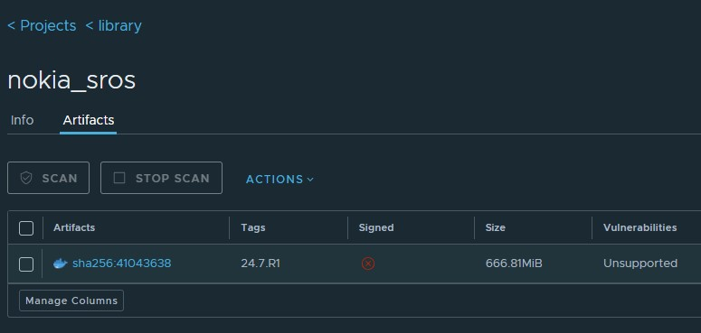

# Container registry and Containerlab

Containerlab is better when used with a container registry. No one loved to witness the uncontrolled proliferation of unversioned disk image (qcow2, vmdk) files shared via ftps, one drives and IM attachments.

We can do better!

Since containerlab deals with container images, it is natural to use a container registry to store them. Versioned, immutable, tagged and easily shareable with granular access control.

Whether you choose to use one of the public registries or a run a private one, the workflow is the same. Let's see what it looks like.

## Harbor registry

In this workshop we make use of an open-source registry called [Harbor](https://goharbor.io/). It is a CNCF graduated project and is a great choice for a private registry.

The registry has been already deployed in the workshop environment, but it is quite easy to deploy yourself in your own organization. It is a single docker compose stack that can be deployed in a few minutes.

The Harbor registry offers a neat Web UI to browse the registry contents, manage users and tune access control. You can log in to the registry UI like this:

[https://registry.wrkshpz.net](https://registry.wrkshpz.net/)

using the `user` user and the password `n93ClabW$`.

Managing the harbor registry is out of the scope of this workshop.

## Pushing images to the registry

**This section is for reference only and you are not required to do this on your VM.**

### 1 Logging in to the registry

To be able to push and pull the images from the workshop's registry, you need to login to the registry from your VM.

```bash
docker login registry.wrkshpz.net
```

```
# username: user
# password: n93ClabW$
```

### 2 Listing local images

First, we need to identify the name of the image that we want to push to the registry. By listing the images in the local image store we can reliably identify the name of the image that we want to push.

```
docker images
```

On your system you will see a list of images, among which you will see:

```
REPOSITORY                      TAG          IMAGE ID       CREATED         SIZE
vrnetlab/nokia_sros             24.7.R1      553e94475c12   38 hours ago    889MB
```

This is the image that we built before and that we want to push to the registry so that next time we want to use it we won't have to build it again.

The image name consists of two parts:

- `vrnetlab/nokia_sros` - the repository name
- `24.7.R1` - the tag

Catenating these two parts together we get the full name of the image that we want to push to the registry.

### 3 Pushing the image to the registry

**This section is for reference only and you are not required to do this on your VM.**

Now that we know the name of the image that we want to push to the registry, we can push it.

We will use `docker push` to upload the image to the registry. Before this, let's tag the image with the name of the registry and a tag.

```bash
docker tag vrnetlab/nokia_sros:24.7.R1 registry.wrkshpz.net/library/nokia_sros:24.7.R1
```

Now we can push the image to the registry.

```bash
docker push registry.wrkshpz.net/library/nokia_sros:24.7.R1
```

Expected output - Note: The user `user` does not have permission to push to the registry and will receive a `permission denied` error.

```bash
The push refers to repository [registry.wrkshpz.net/library/nokia_sros]
30fe1646bed3: Preparing 
a1004ec9baf5: Preparing 
0a58c259d433: Preparing 
c0f1022b22a9: Preparing 
unauthorized: unauthorized to access repository: library/nokia_sros, action: push: unauthorized to access repository: library/nokia_sros, action: push
```

The below output is for a user with permission to push.

```bash
The push refers to repository [https://registry.wrkshpz.net/library/nokia_sros]
626d14695d27: Pushed 
da133bfdd77f: Pushed 
2e873d5d18ac: Pushed 
0595fbac089d: Pushed 
c3548211b826: Pushed 
latest: digest: sha256:77179add9a22a308b675f6eb5956f01feba25cf15f07cda9e8fb36784881b96e size: 1371
```

## Listing images from the registry

Once the image is copied, you can see it in the registry UI.



## Using images from the registry

The whole point of pushing the image to the registry is to be able to use it in the future yourself and also to share it with others.

We will be using the SR OS image that is already in the registry.

Before we pull images from the registry, delete the sros image in your local docker repo.

Get the Image ID for sros image:

```bash
user@1:~$ docker images
REPOSITORY                                            TAG       IMAGE ID       CREATED          SIZE
xrd                                                   7.8.1     1bfb061eca9e   49 minutes ago   1.18GB
vrnetlab/nokia_sros                                   24.7.R1   553e94475c12   38 hours ago     889MB
registry.wrkshpz.net/library/nokia_sros          24.7.R1   553e94475c12   38 hours ago     889MB
ghcr.io/nokia/srlinux                                 latest    eb2a823cd8ce   4 weeks ago      2.35GB
```

Destroy the previous VM lab:

```bash
cd ~/n93-clab/20-vm && sudo clab des
```

Delete the sros docker image (replace with the correct Image ID in your VM):

```bash
docker image rm -f 553e94475c12
```

Run the `docker images` command again to verify that the sros image is removed.

Next, we can modify the `vm.clab.yml` file that was part of the [VM lab](../20-vm/README.md) to make use of the sros image in the registry:

```diff
name: vm
 
prefix: ""
topology:
  defaults:
    kind: nokia_sros
  kinds:
    nokia_sros:
-     image: vrnetlab/nokia_sros:24.7.R1
+     image: registry.wrkshpz.net/library/nokia_sros:24.7.R1
      type: sr-1
      license: /home/user/images/sros-24.lic
    linux:
      image: ghcr.io/srl-labs/network-multitool
```

Deploy the lab using:

```bash
cd ~/n93-clab/20-vm
sudo clab dep -t vm.clab.yml
```

Expected output (showing docker pulling image from registry):

```bash
INFO[0000] Containerlab v0.60.1 started                 
INFO[0000] Parsing & checking topology file: vm.clab.yml 
INFO[0000] Creating docker network: Name="clab", IPv4Subnet="172.20.20.0/24", IPv6Subnet="3fff:172:20:20::/64", MTU=1500 
INFO[0000] Pulling registry.wrkshpz.net/library/nokia_sros:24.7.R1 Docker image 
INFO[0006] Done pulling registry.wrkshpz.net/library/nokia_sros:24.7.R1
<snip>
```

After the lab is deployed, check ping between client1 and client2 similar to what was done for the previous [VM lab](../20-vm/README.md)

Destroy the lab using:

```bash
cd ~/n93-clab/20-vm && sudo clab des
```

Not only this gives us an easy way to share images with others, but also it enables stronger reproducibility of the lab, as the users of our lab would use exactly the same image that we built.
