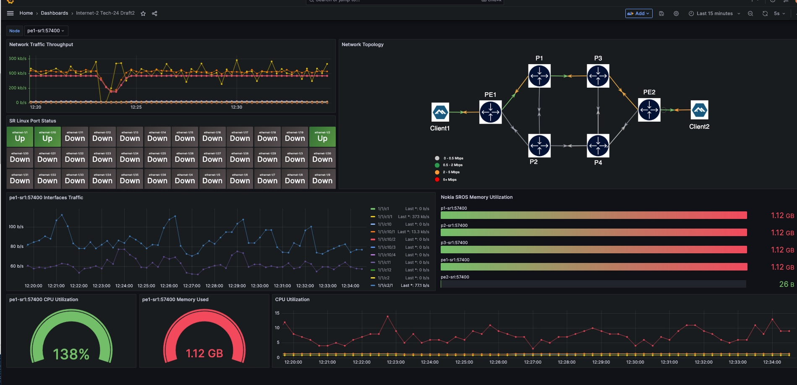

# Streaming Telemetry Lab

When pulling together what we have learned so far, we can build a lab that embodies a lot of what containerlab has to offer. One of the labs that we've built to demonstrate the power of containerlab is the [Streaming Telemetry Lab](https://github.com/srl-labs/srl-telemetry-lab).

For this workshop, we will augment our [vm lab](../20-vm) with gnmic, prometheus and grafana. Let's go ahead and deploy the lab.

```bash
cd ~/n93-clab/45-streaming-telemetry
sudo clab dep -t st_n93_45.clab.yaml
```

This will pull down the repository and deploy the lab right away.

## Exploring the topology file

The streaming telemetry lab' [topology file](https://github.com/srlinuxamericas/n93-clab/blob/main/45-streaming-telemetry/st_n93_45.clab.yaml) is worth a closer look. It features:

- customization of the management network
- use of `defaults` and `kinds` sections to simplify the topology file
- static management IPs for consistency
- combination of network OSes and "regular" containerized workloads like iperf clients, streaming telemetry and logging stack
- use of the bind mounts to load the configuration files
- use of env vars to parametrize the started containers
- `exec` command to run commands in the started containers
- port exposure to the host to make the lab services accessible from the outside
- using of `group` parameter to influence lab nodes ordering in the graph products

As you can see, this topo file has many elements, and once the deployment finishes, you might want to understand what exactly was deployed and how the topology is structured.


